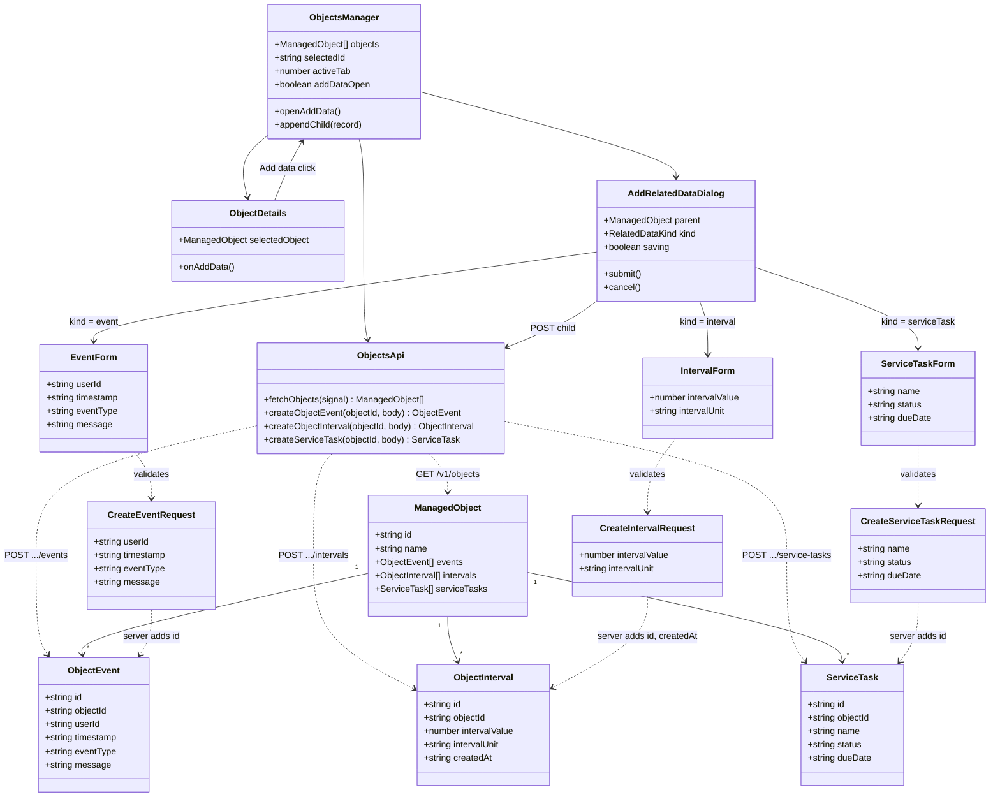

# Add Related Data — class diagram

Objects Manager already owns the loaded `ManagedObject`. The dialog creates one child and returns it to the manager. Field names match [api.md](../api.md). Write methods are proposed.

