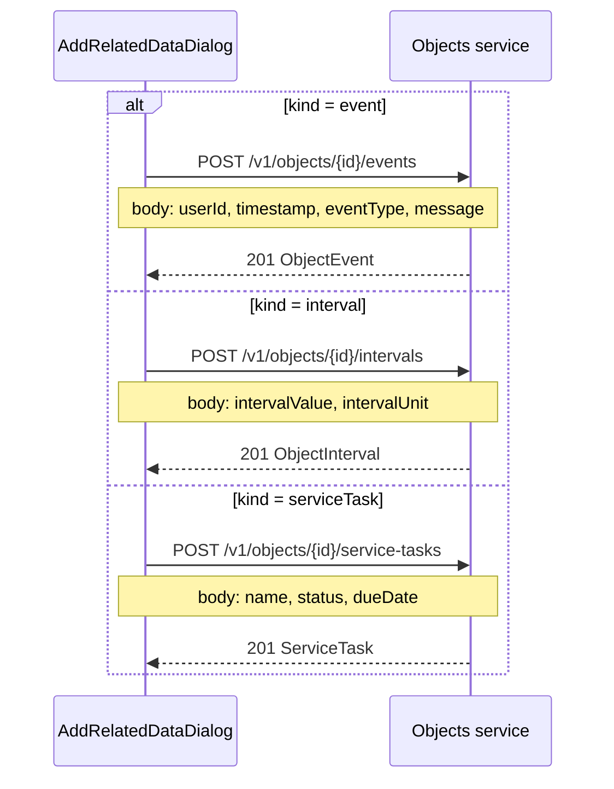

# Add Related Data — sequence diagram

The main form is already open and an object is selected. The operator adds one child record. A failed save stays in the dialog. A successful save updates the list already in memory.

```mermaid
sequenceDiagram
    actor User
    participant Main as ObjectsManager
    participant Details as ObjectDetails
    participant Dialog as AddRelatedDataDialog
    participant Client as ObjectsApi
    participant Proxy as Vite proxy /v1
    participant API as Objects service :8080

    User->>Details: Click Add data
    Details->>Main: onAddData()
    Main->>Dialog: Open for selected ManagedObject

    User->>Dialog: Choose kind and enter fields
    User->>Dialog: Click Save
    Dialog->>Dialog: Validate visible fields

    alt Validation failed
        Dialog-->>User: Helper text on first invalid field
    else Event
        Dialog->>Client: createObjectEvent(objectId, body)
        Client->>Proxy: POST /v1/objects/{objectId}/events
        Proxy->>API: POST /v1/objects/{objectId}/events
    else Interval
        Dialog->>Client: createObjectInterval(objectId, body)
        Client->>Proxy: POST /v1/objects/{objectId}/intervals
        Proxy->>API: POST /v1/objects/{objectId}/intervals
    else Service task
        Dialog->>Client: createServiceTask(objectId, body)
        Client->>Proxy: POST /v1/objects/{objectId}/service-tasks
        Proxy->>API: POST /v1/objects/{objectId}/service-tasks
    end

    alt 201 Created
        API-->>Proxy: Created ObjectEvent, ObjectInterval, or ServiceTask
        Proxy-->>Client: JSON record
        Client-->>Dialog: record
        Dialog->>Main: onCreated(record)
        Main->>Main: Append to selected object, set matching tab
        Main->>Dialog: Close
        Main-->>User: New row on Events, Intervals, or Service tasks
    else 400, 404, or network error
        API-->>Client: Error status or failed fetch
        Client-->>Dialog: Error
        Dialog-->>User: Alert, values kept, dialog stays open
    end

    opt Cancel or Escape
        User->>Dialog: Cancel
        Dialog->>Main: Close without POST
    end
```

## Save sequence by kind


