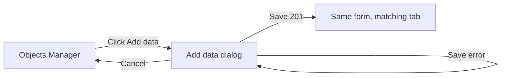

# Add Related Data — UI prototype

Wireframes for the main-form button and the dialog. Labels are the accessible names. Controls are Material UI.

## Screen flow



## Main form

**Add data** sits in the Object Details header. It is disabled until a row in the object list is selected.

```text
+------------------------------------------------------------------+
| Loading Process – Objects Manager                                |
+------------------------------------------------------------------+
| [Filter Type v]  [Filter Status v]  [Search                   ]  |
+---------------------------+--------------------------------------+
| Objects                   | Object Details          [Add data]   |
|                           |                                      |
| > Annual inspection       | Name: Annual inspection              |
|   event · active          | Type: event                          |
|                           | Status: active                       |
|   Mileage check           | ...                                  |
|   mileage · inactive      |                                      |
|                           | [Details] [Events (2)] [Intervals]   |
|                           | [Service tasks]                      |
+---------------------------+--------------------------------------+
```

Disabled state, nothing selected:

```text
| Object Details          [Add data]   |
|                         (disabled)   |
| Select an object to view details.    |
| Select an object before adding data. |
```

## Dialog shell

Title: **Add data**. Parent object is text, not an input. Kind is a radio group so one choice is always visible.

```text
+------------------------------------------------------+
| Add data                                         [X] |
|------------------------------------------------------+
| Object                                               |
| Annual inspection                                    |
| 3f2a...                                              |
|                                                      |
| What do you want to add?                             |
| ( ) Event                                            |
| ( ) Interval                                         |
| (•) Service task                                     |
|                                                      |
| ... kind fields ...                                  |
|                                                      |
| [!] Could not save. Try again.                       |
|                                                      |
|                              [Cancel]  [Save]        |
+------------------------------------------------------+
```

The error alert is hidden until a save fails.

## Event

```text
| (•) Event                                            |
| ( ) Interval                                         |
| ( ) Service task                                     |
|                                                      |
| User *                                               |
| [ jane                                             ] |
|                                                      |
| Date *                                               |
| [ 2026-09-23  14:30                                ] |
|                                                      |
| Type *                                               |
| [ calendar                                         ] |
|                                                      |
| Message *                                            |
| [ Scheduled the next check                         ] |
| [                                                  ] |
```

## Interval

```text
| ( ) Event                                            |
| (•) Interval                                         |
| ( ) Service task                                     |
|                                                      |
| Value *                                              |
| [ 30                                               ] |
|                                                      |
| Unit *                                               |
| [ DAYS                                           v ] |
|     DAYS                                             |
|     WEEKS                                            |
|     MONTHS                                           |
|     YEARS                                            |
```

Invalid value:

```text
| Value *                                              |
| [ 0                                                ] |
| Enter a whole number greater than 0.                 |
```

## Service task

```text
| ( ) Event                                            |
| ( ) Interval                                         |
| (•) Service task                                     |
|                                                      |
| Name *                                               |
| [ Replace filter                                   ] |
|                                                      |
| Status *                                             |
| [ planned                                        v ] |
|     planned                                          |
|     in_progress                                      |
|     done                                             |
|                                                      |
| Due date *                                           |
| [ 2027-02-15                                       ] |
```

## After save

The dialog closes. Objects Manager keeps the same selected object and shows the tab for the saved kind. The new row is last in that table. Example after a service task save:

```text
| Object Details          [Add data]                   |
| [Details] [Events (2)] [Intervals (1)]               |
| [Service tasks (1)]                                  |
|                                                      |
| Name            Status        Due                    |
| Replace filter  planned       2/15/2027              |
```

## Interaction notes

- Changing kind clears only the hidden kind's errors. Values already typed in a kind are kept if the operator switches away and back.
- Save shows a progress state on the button and disables Cancel until the request finishes.
- Focus moves to the dialog title when it opens, and back to **Add data** when it closes.
