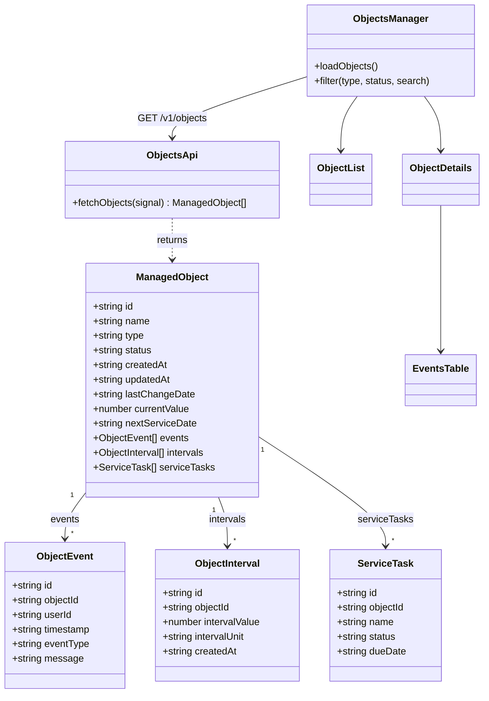
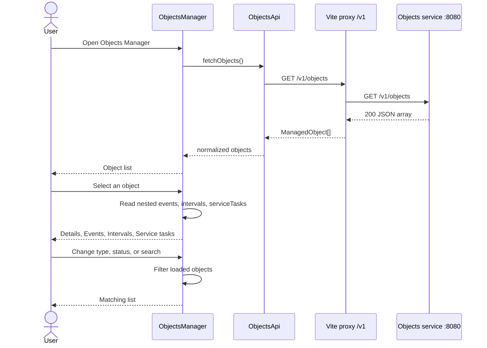

# Objects API

The Objects Manager form loads its list and details from the objects service.

## Endpoint

```http
GET http://localhost:8080/v1/objects
Accept: application/json
```

The Vite dev server proxies `/v1` to `http://localhost:8080`, so the browser calls `/v1/objects`.

Response: `200 OK` with a JSON array of managed objects. Nested `events`, `intervals`, and `serviceTasks` are included on each object. There is no separate events request.

## Model

| Field | Type | Notes |
| --- | --- | --- |
| `id` | string (UUID) | Object identity |
| `name` | string | Shown as the list label and details title |
| `type` | string | Examples: `event`, `calendar`, `mileage` |
| `status` | string | Examples: `planned`, `in_progress` |
| `createdAt` | string (ISO-8601) | Creation timestamp |
| `updatedAt` | string (ISO-8601) | Last update timestamp |
| `lastChangeDate` | string (ISO-8601) | Last business change |
| `currentValue` | number | Shown as current value |
| `nextServiceDate` | string (date) | Next service date, for example `2027-02-15` |
| `events` | ObjectEvent[] | History rows for the Events tab |
| `intervals` | ObjectInterval[] | Service interval rows |
| `serviceTasks` | ServiceTask[] | May be empty |

### ObjectEvent

| Field | Type | Form column |
| --- | --- | --- |
| `id` | string | Row key |
| `objectId` | string | Parent object |
| `userId` | string | User |
| `timestamp` | string | Date |
| `eventType` | string | Type (example: `clandar`) |
| `message` | string | Message |

### ObjectInterval

| Field | Type |
| --- | --- |
| `id` | string |
| `objectId` | string |
| `intervalValue` | number |
| `intervalUnit` | string (`DAYS` and similar) |
| `createdAt` | string (ISO-8601) |

### ServiceTask

The sample payload returns an empty array. The form reads optional `id`, `name`, `status`, and `dueDate` when present.

## UI mapping

| Form control | Source |
| --- | --- |
| Objects list | `name`, `type`, `status` |
| Filter Type / Filter Status | Distinct `type` and `status` values from the response |
| Search | Case-insensitive match on `name` |
| Details tab | Scalar fields on the selected object |
| Events tab | `events` of the selected object |
| Intervals tab | `intervals` of the selected object |
| Service tasks tab | `serviceTasks` of the selected object |

## Class diagram



## Sequence diagram


