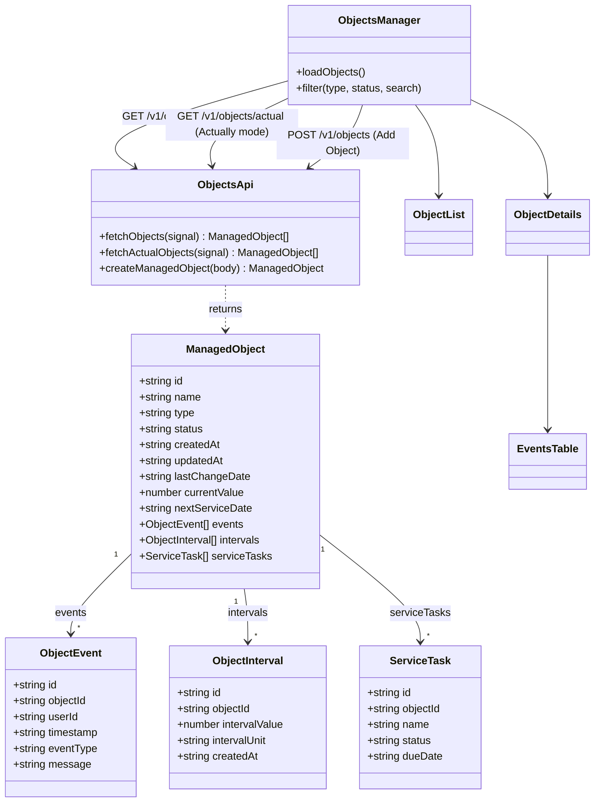
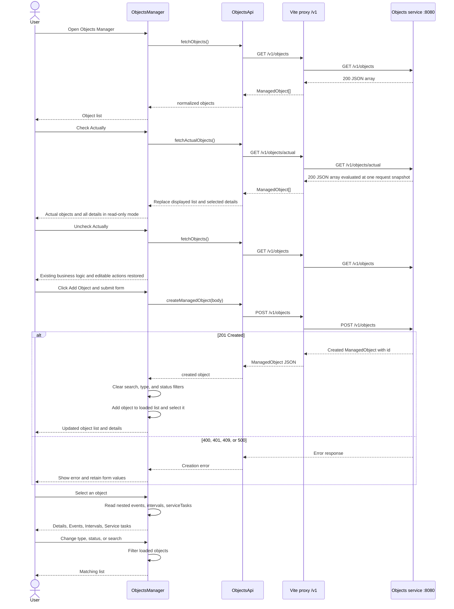

# Objects API

The Objects Manager form loads its list and details from the objects service.

## Endpoint

```http
GET http://localhost:8080/v1/objects
Accept: application/json
```

The Vite dev server proxies `/v1` to `http://localhost:8080`, so the browser calls `/v1/objects`.

Response: `200 OK` with a JSON array of managed objects. Nested `events`, `intervals`, and `serviceTasks` are included on each object. There is no separate events request.

## Load objects that are actual now

The main form's **Actually** checkbox selects a separate, read-only view. When checked, the client calls `GET /v1/objects/actual` instead of `GET /v1/objects`. The backend returns all objects with `status=active`; objects with `status=inactive` are excluded. Type, `currentValue`, `nextServiceDate`, and service-task status do not affect inclusion. These fields and nested records are still returned as object details. The set reflects saved state when the request is processed; the client sends no date, time, or timezone. The endpoint returns `200 OK` with an array using the same `ManagedObject` shape as the regular objects response. An empty result is an empty array. The response does not include `evaluatedAt` because the current UI does not display snapshot time; if that UI requirement is added, extend the response contract with a UTC `evaluatedAt` value.

This request does not create or update objects. When the checkbox is unchecked, the existing `GET /v1/objects` flow and business logic remain unchanged. The checked mode is display-only: the client must not offer create, update, delete, or related-data mutations for the returned objects.

```http
GET /v1/objects/actual
Accept: application/json
Authorization: Bearer <token>
```

## Create managed object

The **+ Add Object** UI creates a `ManagedObject` by calling this endpoint using the contract below. The client implementation is present, but the endpoint details are assumptions and still need confirmation against the service or its OpenAPI specification.

```http
POST /v1/objects
Content-Type: application/json
Accept: application/json
Authorization: Bearer <token>
```

`Content-Type` and `Accept` are required. `Authorization` is optional when the service uses JWT authentication. In the browser, call the same-origin path `/v1/objects` through the Vite proxy; do not hard-code the service host.

### Request body

| Field | Type | Required | Description |
| --- | --- | --- | --- |
| `name` | string, max 255 characters | Yes | Trimmed name; must contain 1-255 characters. Uniqueness is enforced by the server. |
| `type` | string, max 50 characters | Yes | One of `calendar`, `mileage`, `event`, `combined`, `other` |
| `status` | string, max 50 characters | No | One of `active`, `inactive`. Defaults to `active`; the Add Object form sends its selected value. |
| `currentValue` | number, decimal(10,2) | No | Initial value. Defaults to `0.00`. Allows up to 8 integer digits and 2 fractional digits; no non-negative minimum is specified. |
| `nextServiceDate` | date (`YYYY-MM-DD`) | No | Must be a valid calendar date. Past dates are allowed. The Add Object form starts this field empty; omit it from the request body when no date is selected. |

Example:

```json
{
    "name": "Двигатель автомобиля",
    "type": "calendar",
    "status": "active",
    "currentValue": 0.0,
    "nextServiceDate": "2026-08-15"
}
```

### Success response

Returns `201 Created` with the created object, including the server-assigned `id`. Before adding it to application state, the client normalizes the response using the same rules as `GET /v1/objects`: if `events`, `intervals`, or `serviceTasks` are missing or null, they become empty arrays. The normalized object therefore always has all three arrays, which can be read safely by the details tabs.

Example of the normalized object added to application state:

```json
{
    "id": "550e8400-e29b-41d4-a716-446655440000",
    "name": "Двигатель автомобиля",
    "type": "calendar",
    "status": "active",
    "createdAt": "2026-07-10T14:30:00Z",
    "updatedAt": "2026-07-10T14:30:00Z",
    "lastChangeDate": "2026-07-10T14:30:00Z",
    "currentValue": 0.0,
    "nextServiceDate": "2026-08-15",
    "events": [],
    "intervals": [],
    "serviceTasks": []
}
```

### Errors

| Status | Error | Cause | Resolution |
| --- | --- | --- | --- |
| `400 Bad Request` | Missing required field or invalid data format | `name` or `type` is missing, or `currentValue` or `nextServiceDate` has an invalid format | Send required fields with valid types and formats; show field-specific errors where applicable |
| `400 Bad Request` | Invalid `type` | Value is not one of the supported types | Use `calendar`, `mileage`, `event`, `combined`, or `other` |
| `400 Bad Request` | Invalid `status` | Value is not one of the supported statuses | Use `active` or `inactive` |
| `409 Conflict` | Duplicate object name | An object with this name already exists | Show the error on the Name field and choose a different name |
| `401 Unauthorized` | Missing or expired authentication | Request is unauthorized or the JWT has expired | Send a valid JWT in the `Authorization` header when authentication is enabled |
| `500 Internal Server Error` | Server error | The object could not be saved due to a server failure | Retry later or contact the administrator |

## Model

| Field | Type | Notes |
| --- | --- | --- |
| `id` | string (UUID) | Object identity |
| `name` | string | Shown as the list label and details title |
| `type` | string | `calendar`, `mileage`, `event`, `combined`, or `other` |
| `status` | string | `active` or `inactive` |
| `createdAt` | string (ISO-8601) | Creation timestamp |
| `updatedAt` | string (ISO-8601) | Last update timestamp |
| `lastChangeDate` | string (ISO-8601) | Last business change |
| `currentValue` | number | Shown as current value |
| `nextServiceDate` | string (date) | Next service date, for example `2027-02-15` |
| `events` | ObjectEvent[] | History rows for the Events tab |
| `intervals` | ObjectInterval[] | Service interval rows |
| `serviceTasks` | ServiceTask[] | May be empty |

### ObjectEvent

| Field | Type | Form column |
| --- | --- | --- |
| `id` | string | Row key |
| `objectId` | string | Parent object |
| `userId` | string | User |
| `timestamp` | string | Date |
| `eventType` | string | Type (example: `clandar`) |
| `message` | string | Message |

### ObjectInterval

| Field | Type |
| --- | --- |
| `id` | string |
| `objectId` | string |
| `intervalValue` | number |
| `intervalUnit` | string (`DAYS` and similar) |
| `createdAt` | string (ISO-8601) |

### ServiceTask

The sample payload returns an empty array. The form reads optional `id`, `name`, `status`, and `dueDate` when present.

## UI mapping

| Form control | Source |
| --- | --- |
| Objects list | `name`, `type`, `status` |
| Actually checkbox (checked) | `GET /v1/objects/actual`; replaces the regular objects response with all `status=active` objects and enables read-only mode |
| Actually checkbox (unchecked) | Existing `GET /v1/objects` flow and business logic |
| Filter Type / Filter Status | Distinct `type` and `status` values from the response |
| Search | Case-insensitive match on `name` |
| Details tab | Scalar fields on the selected object |
| Events tab | `events` of the selected object |
| Intervals tab | `intervals` of the selected object |
| Service tasks tab | `serviceTasks` of the selected object |

## Class diagram


```mermaid
classDiagram
    class ObjectsApi {
        +fetchObjects(signal) ManagedObject[]
        +fetchActualObjects(signal) ManagedObject[]
        +createManagedObject(body) ManagedObject
    }

    class ManagedObject {
        +string id
        +string name
        +string type
        +string status
        +string createdAt
        +string updatedAt
        +string lastChangeDate
        +number currentValue
        +string nextServiceDate
        +ObjectEvent[] events
        +ObjectInterval[] intervals
        +ServiceTask[] serviceTasks
    }

    class ObjectEvent {
        +string id
        +string objectId
        +string userId
        +string timestamp
        +string eventType
        +string message
    }

    class ObjectInterval {
        +string id
        +string objectId
        +number intervalValue
        +string intervalUnit
        +string createdAt
    }

    class ServiceTask {
        +string id
        +string objectId
        +string name
        +string status
        +string dueDate
    }

    class ObjectsManager {
        +loadObjects()
        +filter(type, status, search)
    }

    class ObjectList
    class ObjectDetails
    class EventsTable

    ObjectsApi ..> ManagedObject : returns
    ManagedObject "1" --> "*" ObjectEvent : events
    ManagedObject "1" --> "*" ObjectInterval : intervals
    ManagedObject "1" --> "*" ServiceTask : serviceTasks
    ObjectsManager --> ObjectsApi : GET /v1/objects
    ObjectsManager --> ObjectsApi : GET /v1/objects/actual (Actually mode)
    ObjectsManager --> ObjectsApi : POST /v1/objects (Add Object)
    ObjectsManager --> ObjectList
    ObjectsManager --> ObjectDetails
    ObjectDetails --> EventsTable
```

## Sequence diagram


```mermaid
sequenceDiagram
    actor User
    participant Form as ObjectsManager
    participant Client as ObjectsApi
    participant Proxy as Vite proxy /v1
    participant API as Objects service :8080

    User->>Form: Open Objects Manager
    Form->>Client: fetchObjects()
    Client->>Proxy: GET /v1/objects
    Proxy->>API: GET /v1/objects
    API-->>Proxy: 200 JSON array
    Proxy-->>Client: ManagedObject[]
    Client-->>Form: normalized objects
    Form-->>User: Object list

    User->>Form: Check Actually
    Form->>Client: fetchActualObjects()
    Client->>Proxy: GET /v1/objects/actual
    Proxy->>API: GET /v1/objects/actual
    API-->>Proxy: 200 JSON array evaluated at one request snapshot
    Proxy-->>Client: ManagedObject[]
    Client-->>Form: Replace displayed list and selected details
    Form-->>User: Actual objects and all details in read-only mode

    User->>Form: Uncheck Actually
    Form->>Client: fetchObjects()
    Client->>Proxy: GET /v1/objects
    Proxy->>API: GET /v1/objects
    Form-->>User: Existing business logic and editable actions restored

    User->>Form: Click Add Object and submit form
    Form->>Client: createManagedObject(body)
    Client->>Proxy: POST /v1/objects
    Proxy->>API: POST /v1/objects
    alt 201 Created
        API-->>Proxy: Created ManagedObject with id
        Proxy-->>Client: ManagedObject JSON
        Client-->>Form: created object
        Form->>Form: Clear search, type, and status filters
        Form->>Form: Add object to loaded list and select it
        Form-->>User: Updated object list and details
    else 400, 401, 409, or 500
        API-->>Client: Error response
        Client-->>Form: Creation error
        Form-->>User: Show error and retain form values
    end

    User->>Form: Select an object
    Form->>Form: Read nested events, intervals, serviceTasks
    Form-->>User: Details, Events, Intervals, Service tasks

    User->>Form: Change type, status, or search
    Form->>Form: Filter loaded objects
    Form-->>User: Matching list
```
